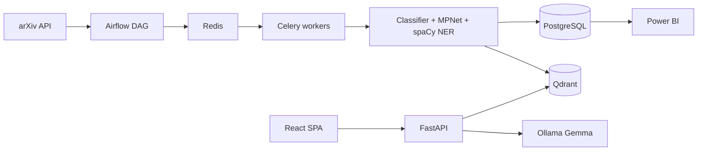
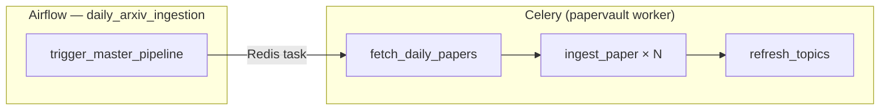
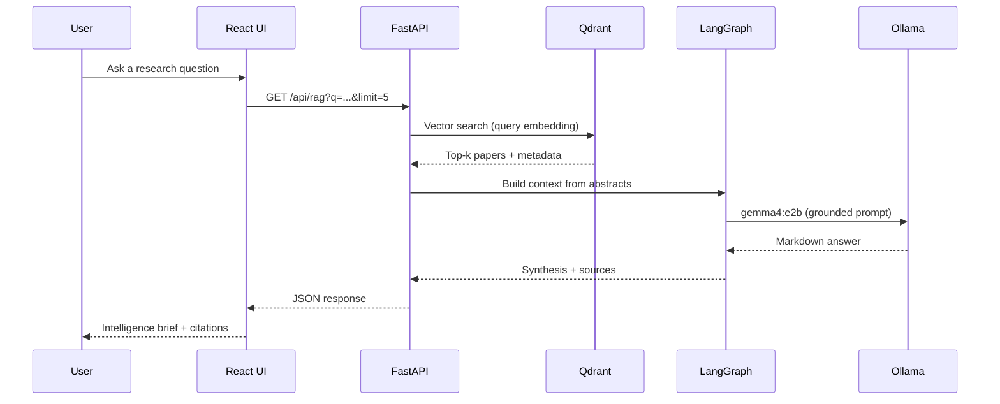
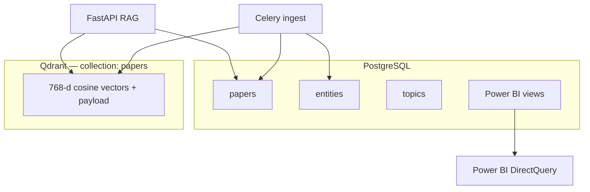
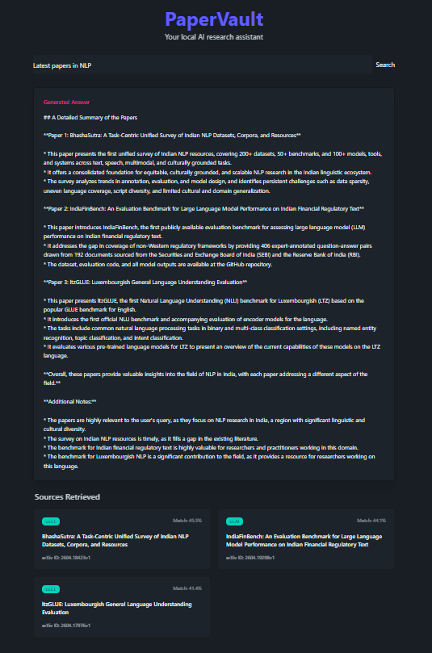
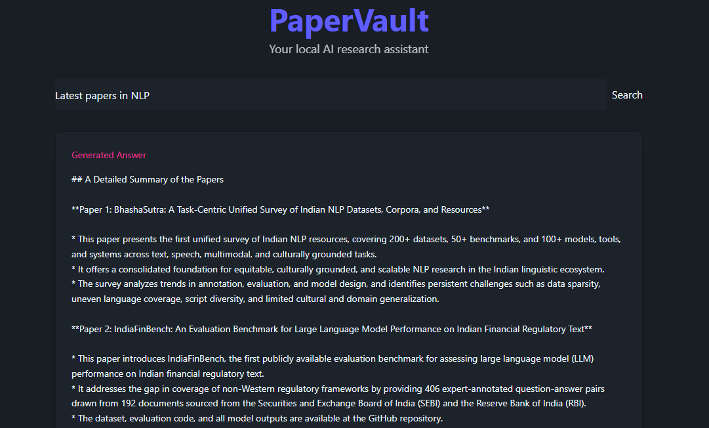
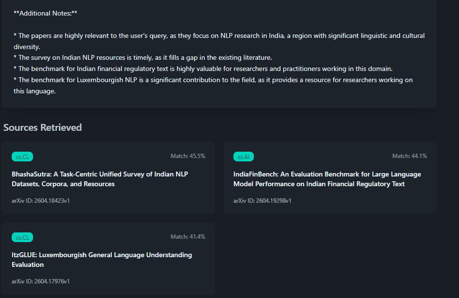
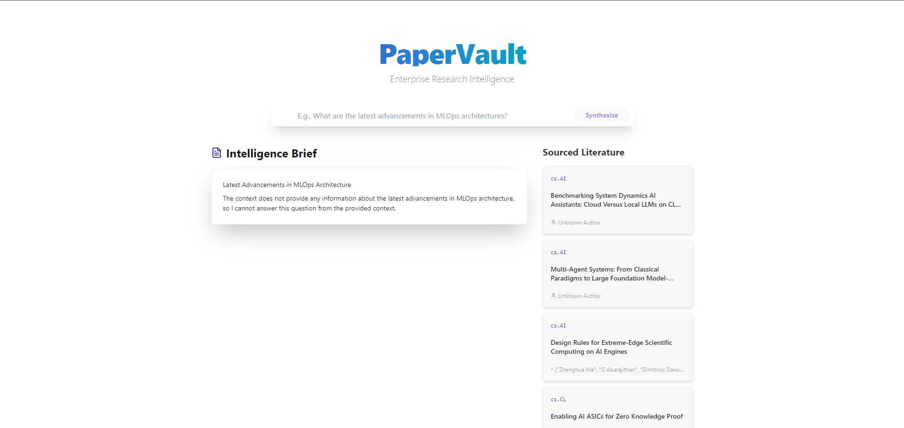
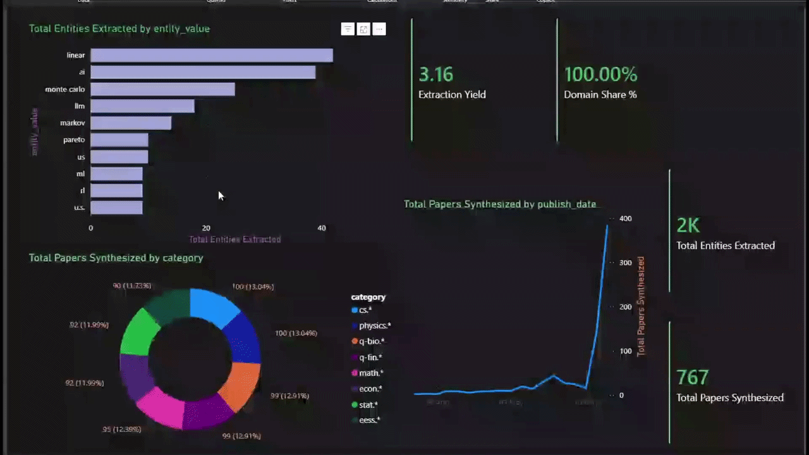
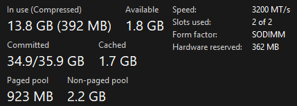

# PaperVault


**Local-first research intelligence for arXiv** — ingest papers on a schedule, classify them with a CPU ML ensemble, index them for semantic search, and answer questions with a grounded RAG pipeline (FastAPI + Qdrant + Ollama).

| | |
|---|---|
| **Author** | Anurag Pandey |
| **Stack** | Python 3.11 · FastAPI · Celery · Airflow · PostgreSQL · Qdrant · React · Ollama |
| **Design goal** | End-to-end ML/RAG on modest hardware (~4GB VRAM for the LLM) |

<p align="center">
  <video src="demos/PaperVault-demo.mp4" width="900" controls></video>
</p>

---

## Table of contents

- [Features](#features)
- [Architecture](#architecture)
- [How it works](#how-it-works)
- [Tech stack](#tech-stack)
- [Prerequisites](#prerequisites)
- [Quick start](#quick-start)
- [Full setup guide](#full-setup-guide)
- [Verify the installation](#verify-the-installation)
- [Service URLs](#service-urls)
- [Screenshots & demos](#screenshots--demos)
- [Power BI analytics](#power-bi-analytics)
- [Project structure](#project-structure)
- [CI/CD](#cicd)
- [Troubleshooting](#troubleshooting)
- [Research & notebooks](#research--notebooks)

---

## Features

| Area | What you get |
|------|----------------|
| **Ingestion** | Scheduled Airflow DAG → Redis → Celery workers fetch arXiv XML, respect rate limits, dedupe by `arxiv_id` |
| **ML (CPU)** | TF-IDF + stacking ensemble for domain labels; spaCy NER for entities; `all-mpnet-base-v2` (768-d) embeddings |
| **Storage** | PostgreSQL for metadata & entities; Qdrant for vector search |
| **RAG** | LangGraph + Ollama (`gemma4:e2b`) with strict grounding and inline citation links |
| **UI** | React SPA — semantic search, markdown briefs (KaTeX), citation cards, forest/fantasy themes |
| **Analytics** | Alembic views for Power BI DirectQuery on Postgres |

---

## Architecture

High-level data flow from arXiv through ingestion, storage, query, and analytics:



<details>
<summary><strong>Legend</strong></summary>

| Component | Role |
|-----------|------|
| **Airflow** | Daily scheduler; triggers the Celery ingestion pipeline |
| **Celery** | Fetches papers, runs ML/NLP, writes to Postgres + Qdrant |
| **FastAPI** | Serves `/api/rag` and `/api/predict` (runs on the host in dev) |
| **Ollama** | Local LLM for synthesis (not in Docker — install on host) |
| **Power BI** | Optional; connects to Postgres analytics views |

</details>

---

## How it works

### 1. Ingestion pipeline

Airflow does not process papers itself — it dispatches work to your **backend Celery** workers:



Per paper, `ingest_paper`:

1. Skips duplicates in Postgres  
2. Classifies abstract (stacking ensemble)  
3. Extracts entities (spaCy)  
4. Embeds abstract (MPNet → 768-d)  
5. Upserts Postgres + Qdrant  

### 2. RAG query path



### 3. Dual-database layout



---

## Tech stack

| Layer | Technologies |
|-------|----------------|
| Orchestration | Apache Airflow 2.9, Celery, Redis |
| API | FastAPI, Pydantic, Alembic |
| ML / NLP | scikit-learn (joblib), sentence-transformers, spaCy |
| Vector DB | Qdrant 1.9 |
| RAG | LangChain, LangGraph, Ollama |
| Frontend | React 19, Vite, Tailwind CSS, DaisyUI, Framer Motion |
| Infra | Docker Compose, GitHub Actions |

---

## Prerequisites

Install these **before** cloning:

| Tool | Version | Notes |
|------|---------|--------|
| [Git](https://git-scm.com/) | latest | Clone the repo |
| [Docker Desktop](https://www.docker.com/products/docker-desktop/) | latest | Runs Postgres, Redis, Qdrant, Airflow, Celery |
| [Python](https://www.python.org/) | **3.11** | Host API + Alembic |
| [Node.js](https://nodejs.org/) | **20+** | Frontend dev server |
| [Ollama](https://ollama.com/) | latest | Local LLM for RAG |

**Hardware (guidance)**

- **Minimum:** 16 GB RAM, 4 CPU cores, ~10 GB free disk (Docker images + embeddings cache)  
- **GPU:** Optional. `docker-compose.yml` reserves an NVIDIA GPU for the Celery worker; remove the `deploy.resources` block under `celery-worker` if you do not have one.  
- **First ingest:** Downloads `all-mpnet-base-v2` and spaCy models — can take several minutes.

---

## Quick start

> **TL;DR** — infrastructure in Docker; API and UI on the host.

```bash
git clone https://github.com/luvyansh/papervault.git
cd papervault

cp .env.example .env

docker compose up -d --build
# Wait until backend-init completes (DB migrations)

ollama pull gemma4:e2b

# Terminal A — API
cd backend
python -m venv venv
# Windows:  .\venv\Scripts\activate
# macOS/Linux:  source venv/bin/activate
pip install -r requirements.txt
uvicorn app.main:app --reload

# Terminal B — UI
cd frontend
npm install
npm run dev
```

Open **http://localhost:5173** (Vite may use another port — check the terminal).  
API docs: **http://127.0.0.1:8000/docs**

---

## Full setup guide

### Step 1 — Clone and configure

```bash
git clone https://github.com/<your-username>/papervault.git
cd papervault
cp .env.example .env
```

Edit `.env` if you need different arXiv categories or DB credentials. Defaults match `docker-compose.yml`.

### Step 2 — Build and start Docker services

From the **repository root**:

```bash
docker compose up -d --build
```

This starts:

| Service | Purpose |
|---------|---------|
| `postgres` | Relational DB (host port **5433**) |
| `redis` | Celery broker |
| `qdrant` | Vector store |
| `backend-init` | Runs `init_db.py` + `alembic upgrade head` once |
| `celery-worker` | Ingestion + ML pipeline |
| `flower` | Celery monitoring |
| `airflow-*` | Scheduler, web UI, workers |

**Check that init succeeded:**

```bash
docker compose ps
docker compose logs backend-init
```

You should see: `Backend Database is fully configured and ready!`

<details>
<summary><strong>Rebuild images from scratch</strong></summary>

```bash
docker compose down -v   # WARNING: deletes DB/Qdrant volumes
docker compose build --no-cache
docker compose up -d
```

</details>

### Step 3 — Python environment (host API)

The FastAPI app is **not** in Compose — run it on your machine so it can reach Ollama:

```bash
cd backend
python -m venv venv
```

**Windows (PowerShell):**

```powershell
.\venv\Scripts\activate
pip install -r requirements.txt
```

**macOS / Linux:**

```bash
source venv/bin/activate
pip install -r requirements.txt
```

Pre-trained classifiers ship in `backend/app/models/` (`*.pkl`). On first ingest, sentence-transformers and spaCy models download automatically inside the Celery container.

### Step 4 — Ollama model

```bash
ollama pull gemma4:e2b
ollama list
```

The RAG generator expects `gemma4:e2b` (see `backend/app/services/generator.py`). Change the model name there if you use a different tag.

### Step 5 — Frontend

```bash
cd frontend
npm install
npm run dev
```

### Step 6 — (Optional) Run migrations on the host

Usually handled by `backend-init`. If you develop against Postgres from the host:

```bash
cd backend
alembic upgrade head
```

### Makefile shortcuts

If you have `make` installed:

```bash
make dev      # docker compose up -d --build
make ingest   # trigger arXiv fetch via Celery
make api      # uvicorn on :8000
make ui       # npm run dev
make down     # stop stack
```

---

## Verify the installation

### 1. Health check

```bash
curl http://127.0.0.1:8000/
# {"status":"PaperVault Backend is actively running."}
```

### 2. Load the corpus (ingestion)

**Option A — Airflow UI**

1. Open http://localhost:8081 (login: `admin` / `admin`)  
2. Unpause DAG `daily_arxiv_ingestion`  
3. Trigger DAG manually (play button)

**Option B — Celery (recommended for first test)**

```bash
docker compose exec celery-worker celery -A app.services.celery_app call app.etl.tasks.fetch_daily_papers
```

Watch progress:

```bash
docker compose logs -f celery-worker
```

> **Note:** A full category sweep can take a long time and hit arXiv rate limits. For a quick test, temporarily set `ARXIV_MAX_RESULTS_PER_CATEGORY=5` in `.env`, restart `celery-worker`, then run the command again.

### 3. Confirm data landed

- **Qdrant:** http://localhost:6333/dashboard — collection `papers` should have points  
- **Postgres:** `docker compose exec postgres psql -U papervault -d papervault -c "SELECT COUNT(*) FROM papers;"`

### 4. Test RAG in the UI

1. Ensure API (`:8000`) and UI (Vite) are running  
2. Open the app, enter a question (e.g. *What are recent advances in transformer efficiency?*)  
3. You should see an **Intelligence Brief** and **Sourced Literature** cards  

**Direct API test:**

```bash
curl "http://127.0.0.1:8000/api/rag?q=transformer%20attention&limit=3"
```

### 5. Test ML classification

```bash
curl -X POST http://127.0.0.1:8000/api/predict \
  -H "Content-Type: application/json" \
  -d "{\"abstract\": \"We propose a novel graph neural network for protein folding.\"}"
```

---

## Service URLs

| Service | URL | Credentials |
|---------|-----|-------------|
| React UI | http://localhost:5173 | — |
| FastAPI | http://127.0.0.1:8000 | — |
| Swagger | http://127.0.0.1:8000/docs | — |
| Airflow | http://localhost:8081 | `admin` / `admin` |
| Flower | http://localhost:5555 | — |
| Qdrant | http://localhost:6333/dashboard | — |
| Postgres | `localhost:5433` | `papervault` / `papervault` |

---

## Screenshots & demos

| | |
|---|---|
| **Dark theme** |  |
| **Detail view** |  |
| **Citations** |  |
| **Light theme** |  |
| **Power BI** |  |
| **System usage** |  |

---

## Power BI analytics

The Postgres schema includes **analytics views** (created by Alembic migrations) for Power BI **DirectQuery**:

- Executive KPIs (papers ingested, entities extracted)  
- Domain distribution (ML-predicted categories)  
- Top entities by domain (interactive slicers)

Connect Power BI Desktop to:

- **Server:** `localhost,5433`  
- **Database:** `papervault`  
- **User / password:** `papervault` / `papervault`

Refresh the dataset after ingestion runs to see new papers.

---

## Project structure

```text
papervault/
├── airflow/dags/              # Airflow DAG (triggers Celery)
├── backend/
│   ├── app/
│   │   ├── config/            # Settings (.env)
│   │   ├── db/                # SQLAlchemy models + Alembic
│   │   ├── etl/               # arXiv client + Celery tasks
│   │   ├── models/            # Serialized ML artifacts (*.pkl)
│   │   ├── nlp/               # Embedder, NER, summarizer
│   │   └── services/          # RAG, retriever, Celery app
│   ├── Dockerfile.dev
│   ├── pre_start.sh           # DB init (used by backend-init)
│   └── requirements.txt
├── frontend/                  # React + Vite SPA
├── demos/                     # README screenshots & GIFs
├── docker-compose.yml
├── .env.example
├── MAKEFILE                   # Convenience commands
└── .github/workflows/         # CI
```

---

## CI/CD

On every push/PR to `main`, GitHub Actions:

1. Installs Python 3.11 dependencies  
2. Runs `flake8` on `backend/app/`  
3. Validates `docker compose config` and builds images  

See [`.github/workflows/main.yml`](.github/workflows/main.yml).

---

## Troubleshooting

<details>
<summary><strong>Docker: backend-init failed</strong></summary>

```bash
docker compose logs backend-init
docker compose exec postgres pg_isready -U papervault
```

Re-run migrations:

```bash
cd backend && alembic upgrade head
```

</details>

<details>
<summary><strong>Celery worker exits / GPU error</strong></summary>

If you do not have an NVIDIA GPU, remove the `deploy.resources` section under `celery-worker` in `docker-compose.yml`, then:

```bash
docker compose up -d --build celery-worker
```

</details>

<details>
<summary><strong>RAG returns empty sources</strong></summary>

- Run ingestion first (see [Verify the installation](#verify-the-installation))  
- Confirm Qdrant has vectors: http://localhost:6333/dashboard  
- Ensure `QDRANT_URL` in `.env` is `http://127.0.0.1:6333` for the **host** API (not `http://qdrant:6333`)

</details>

<details>
<summary><strong>Ollama connection errors</strong></summary>

- `ollama serve` must be running  
- `ollama pull gemma4:e2b`  
- Test: `ollama run gemma4:e2b "hello"`

</details>

<details>
<summary><strong>Frontend cannot reach API</strong></summary>

The UI calls `http://127.0.0.1:8000` (see `frontend/src/App.tsx`). Start the API on that host/port or update the fetch URL for your environment.

</details>

<details>
<summary><strong>arXiv 429 rate limits</strong></summary>

Lower `ARXIV_MAX_RESULTS_PER_CATEGORY` in `.env`, wait 60s, and re-trigger ingestion. The client backs off automatically on HTTP 429.

</details>

---

## Research & notebooks

Offline experimentation (EDA, ensemble training, embedding benchmarks) lives under `notebooks/`:

- `PreComputation.ipynb` — corpus exploration and model training  
- `Benchmarks.ipynb` — embedding and retrieval benchmarks  

Exported artifacts are committed under `backend/app/models/` for reproducible ingestion without retraining.

---

## License

[MIT](LICENSE) — see `LICENSE` for details.

---

<p align="center">
  <sub>Built by Anurag Pandey · arXiv → ML → Vectors → Grounded answers</sub>
</p>
