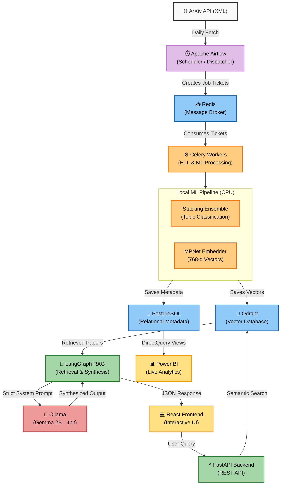
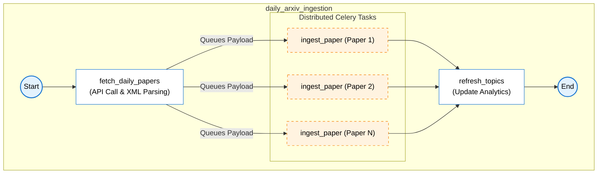

# PaperVault: Enterprise Research Intelligence Platform

**Author:** Anurag Pandey
**Project Type:** Full-Stack AI Capstone / Professional Technical Portfolio

---

## 1. Project Intuition & Vision

Staying current with the relentless flood of daily academic research on arXiv is mathematically impossible for a single human. The intuition behind **PaperVault** was to build an automated "Research Intelligence" platform capable of ingesting, classifying, and synthesizing massive volumes of scientific literature daily.

However, the true engineering challenge was architectural: How do we build a State-of-the-Art (SOTA), end-to-end Machine Learning and Retrieval-Augmented Generation (RAG) pipeline that can run **entirely locally on low-end hardware (e.g., a strict 4GB VRAM constraint)** while maintaining enterprise-grade accuracy?

PaperVault is the solution. It is a fully containerized, microservice-driven application that orchestrates automated ETL pipelines, local ML ensembles, dense vector embeddings, and a strict, anti-hallucination LangGraph RAG workflow powered by quantized edge models.

---

## 2. Research & Pre-Computation Pipeline

Before writing a single line of backend API code, the foundation of PaperVault was forged in Kaggle/Colab notebooks. The goal was to establish a rigorous, highly optimized pipeline that could be exported and deployed locally.

* **Exploratory Data Analysis (EDA):** Scraped an initial corpus of ~2,000 multi-domain research papers across 8 distinct categories (Physics, Math, Quant Finance, Quant Biology, CS, etc.). Analyzed class balances, abstract lengths, and null values.
* **Machine Learning Ensemble:** Trained and serialized a highly accurate (90%+) Stacking Ensemble classifier alongside a Label Encoder and TF-IDF Vectorizer. This ensemble classifies incoming papers in milliseconds on the CPU, removing the need for heavy LLM inference during ingestion.
* **Vectorization Upgrade:** Benchmarked embedding models and deliberately upgraded to the 768-dimension `all-mpnet-base-v2` model. It provided superior semantic clustering for scientific text while remaining small enough to run natively on local CPUs without locking up system resources.
* **Model Serialization:** Exported the fully trained pipeline components (`.pkl` files) and initial corpus metadata directly from the notebook to ensure the FastAPI backend could load them instantly into memory via its Lifespan events.

---

## 3. Technology Stack & Architecture

PaperVault is built on a modern, decoupled tech stack designed for resilience, scalability, and local execution.

**Data Engineering & Orchestration**

* **Apache Airflow:** Acts as the "Dispatcher," managing the daily ETL DAG that fetches XML data from the arXiv API, respects rate limits, and queues ingestion tasks.
* **Celery & Redis:** The "Muscle." Background workers process the queued tasks, run the text through the ML classifier, generate embeddings, and load the databases asynchronously.

**Database Layer (Dual-Architecture)**

* **PostgreSQL:** Relational storage for paper metadata, extracted NLP entities, and Power BI analytical views.
* **Qdrant:** High-performance Vector Database storing the 768-dimensional document embeddings for semantic similarity search.

**Backend & AI Engine**

* **Python 3.11 & FastAPI:** High-performance asynchronous API serving the RAG endpoints and UI data.
* **LangGraph & LangChain:** Orchestrates the generative RAG workflow.
* **Ollama (Gemma 2B):** A highly capable frontier edge model running in 4-bit quantization, allowing the generative AI to easily fit within 4GB VRAM. It operates under a strict anti-hallucination system prompt and context-truncation protocol to guarantee factual grounding.

**Frontend & Analytics**

* **React + Vite + Tailwind CSS:** A sleek, SaaS-style user interface utilizing Framer Motion for elegant modal transitions and responsive design.
* **Power BI:** Live enterprise dashboard tethered to the Postgres database via DirectQuery.

---

## 4. Power BI: Enterprise Analytics & Intelligence

*Space reserved for Power BI Dashboard Demo GIF*

**[ Insert `powerbi_demo.gif` Here ]**

The analytical layer of PaperVault is built to provide immediate executive intelligence. Because the dashboard connects to the live PostgreSQL database via **DirectQuery**, no manual data imports or complex DAX scheduling are required. The moment Airflow ingests a new batch of papers, a simple dashboard refresh updates the entire canvas.

**Dashboard Features:**

* **Executive KPI Banner:** Tracks "Total Papers Synthesized," "Total Entities Extracted," and the dynamic "Extraction Yield" across scientific domains.
* **Domain Split (Donut Chart):** Visualizes the categorical breakdown of the ingested corpus (e.g., `physics.*`, `math.*`, `q-fin.*`, `q-bio.*`) based on the predictions from the local ML Stacking Ensemble.
* **Entity Radar (Bar Chart):** Displays the Top 10 extracted technical terms and concepts across the corpus.
* **Interactive SaaS Filtering:** By clicking directly on a slice (e.g., Physics) in the Domain Share chart, the relational model instantly recalculates the KPI cards and filters the Entity Radar to show only the concepts relevant to that specific domain.

---

## 5. User Interface (Frontend)

*Space reserved for React Frontend Demo GIF / Screenshots*

**[ Insert `frontend_rag_demo.gif` Here ]**

**[ Insert `paper_modal_screenshot.png` Here ]**

The frontend is a dedicated React SPA designed to surface the complex backend RAG architecture seamlessly. It features a custom skeleton loader, dynamic confidence badges reflecting the ML pipeline's predictions, and an interactive layout that prevents context switching by handling document reading directly within the app.

---

## 6. Continuous Integration / Continuous Deployment (CI/CD)

The project leverages GitHub Actions to enforce code quality and infrastructure stability automatically on every push to the `main` branch.

```yaml
name: PaperVault CI/CD

on:
  push:
    branches: [ "main" ]
  pull_request:
    branches: [ "main" ]

jobs:
  integration-test:
    runs-on: ubuntu-latest

    steps:
      - name: Checkout Repository
        uses: actions/checkout@v4

      - name: Set up Python 3.11
        uses: actions/setup-python@v5
        with:
          python-version: "3.11"
          cache: "pip"

      - name: Install Backend Dependencies
        working-directory: ./backend
        run: |
          python -m pip install --upgrade pip
          pip install -r requirements.txt

      - name: Check Code Formatting (Ruff / Flake8)
        working-directory: ./backend
        run: |
          pip install flake8
          flake8 app/ --count --select=E9,F63,F7,F82 --show-source --statistics

      - name: Validate Docker Infrastructure
        run: |
          docker compose config
          docker compose build

```

---

## 7. Project Directory Structure

```text
luvyansh@StunX:/mnt/e/Projects/papervault$ tree -I '.git|node_modules|__pycache__|venv'
.
├── Help.md
├── MAKEFILE
├── airflow
│   └── dags
│       └── arxiv_ingestion_dag.py
├── backend
│   ├── Dockerfile.dev
│   ├── alembic.ini
│   ├── app
│   │   ├── __init__.py
│   │   ├── config
│   │   │   ├── __init__.py
│   │   │   └── settings.py
│   │   ├── db
│   │   │   ├── __init__.py
│   │   │   ├── migrations
│   │   │   │   ├── README
│   │   │   │   ├── env.py
│   │   │   │   ├── script.py.mako
│   │   │   │   └── versions
│   │   │   │       ├── 1447c589ce26_create_powerbi_analytics_views.py
│   │   │   │       ├── cd150a31e02f_create_powerbi_analytics_views.py
│   │   │   │       └── d4177f8edc8f_initial_schema_setup.py
│   │   │   ├── models.py
│   │   │   └── session.py
│   │   ├── etl
│   │   │   ├── __init__.py
│   │   │   ├── arxiv_client.py
│   │   │   ├── tasks.py
│   │   │   └── validators.py
│   │   ├── main.py
│   │   ├── models
│   │   │   ├── label_encoder.pkl
│   │   │   ├── stacking_ensemble.pkl
│   │   │   └── tfidf_vectorizer.pkl
│   │   ├── nlp
│   │   │   ├── __init__.py
│   │   │   ├── embedder.py
│   │   │   ├── ner.py
│   │   │   └── summarizer.py
│   │   ├── services
│   │   │   ├── __init__.py
│   │   │   ├── celery_app.py
│   │   │   ├── generator.py
│   │   │   ├── ml_services.py
│   │   │   └── retriever.py
│   │   └── utils
│   │       └── __init__.py
│   ├── fix_qdrant.py
│   ├── init_db.py
│   ├── requirements.txt
│   ├── reset_schema.py
│   └── tests
│       ├── __init__.py
│       └── unit
│           └── __init__.py
├── docker-compose.yml
├── docs
│   └── adr
├── frontend
│   ├── README.md
│   ├── components.json
│   ├── eslint.config.js
│   ├── index.html
│   ├── package-lock.json
│   ├── package.json
│   ├── postcss.config.js
│   ├── public
│   │   ├── favicon.svg
│   │   └── icons.svg
│   ├── src
│   │   ├── App.css
│   │   ├── App.tsx
│   │   ├── assets
│   │   │   ├── hero.png
│   │   │   ├── react.svg
│   │   │   └── vite.svg
│   │   ├── components
│   │   │   └── animate-ui
│   │   │       ├── components
│   │   │       │   └── buttons
│   │   │       │       └── liquid.tsx
│   │   │       └── primitives
│   │   │           ├── animate
│   │   │           │   └── slot.tsx
│   │   │           └── buttons
│   │   │               └── liquid.tsx
│   │   ├── index.css
│   │   ├── lib
│   │   │   ├── get-strict-context.tsx
│   │   │   └── utils.ts
│   │   └── main.tsx
│   ├── tailwind.config.js
│   ├── tsconfig.app.json
│   ├── tsconfig.json
│   ├── tsconfig.node.json
│   └── vite.config.ts
└── notebooks
    ├── Benchmarks.ipynb
    └── EDA.ipynb

```

---

## 8. Setup & Execution Guide

To run PaperVault locally from scratch, execute the following steps in order to provision the virtual environment, spin up the Docker containers, run the database migrations, and launch the UI.

**1. Initialize the Python Environment**

```bash
python -m venv venv

```

**2. Activate Virtual Environment**

```bash
cd backend
# On Windows:
venv\Scripts\activate
# On Mac/Linux:
source venv/bin/activate

```

**3. Install Dependencies**

```bash
pip install -r requirements.txt

```

**4. Spin up the Docker Infrastructure (Detached)**

```bash
docker-compose up -d

```

**5. Initialize the Database (Temporary script for first-run tables)**

```bash
python init_db.py

```

**6. Migrate the Airflow Internal Database**

```bash
docker-compose run --rm airflow-webserver airflow db migrate

```

**7. Monitor Airflow Webserver Logs**

```bash
docker-compose logs -f airflow-webserver

```

**8. Monitor Airflow Worker Logs**

```bash
docker-compose logs -f airflow-worker

```

**9. Monitor Celery Processing Logs (Model Downloads/Ingestion)**

```bash
docker-compose logs -f celery-worker

```

**10. Reset Partial Schemas (If necessary before Alembic)**

```bash
python reset_schema.py

```

**11. Execute Alembic Migrations (Builds correct relational structure and Power BI Views)**

```bash
alembic upgrade head

```

**12. Launch the FastAPI Backend**

```bash
uvicorn app.main:app --reload

```

**13. Launch the React Frontend**

```bash
# Open a new terminal window
cd frontend
npm run dev

```


## 9. End-to-End Workflow Architecture Diagram

Paste this anywhere in your README. It shows the complete flow of data from ArXiv all the way to the React UI and Power BI dashboard.



## 10. Airflow DAG Architecture

This diagram visualizes the specific task mapping and dependencies inside your Airflow orchestration layer.


